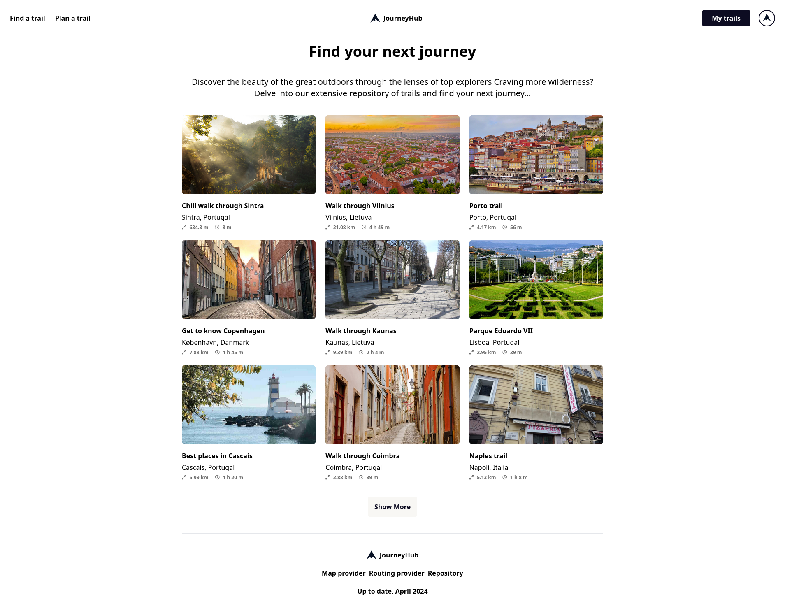

<p align="center">
  
</p>

## What is it JourneyHub?

**JourneyHub**: An open source trail planning application at your service. With the power of [OpenStreetMap](https://www.openstreetmap.org) and [OSRM](https://project-osrm.org/) engine, we simplify your trail planning, guiding you every step of the way.

## Technologies

We use .NET to power our server, and Angular to power our frontend. Almost all of the code you'll touch in this codebase will be TypeScript and C#.

Here is a list of all the big technologies we use:

- **.NET 8**: Our backend framework of choice
- **Angular 16**: Our frontend framework of choice
- **PostgreSQL 16**: Object-relational
  database
- **Tailwind CSS**: CSS framework

## UI Demo

### Plan a trail


### View a trail


### Explore trails



### Edit your profile


# Project Setup

Navigate to the directory of choice and clone the project

```console
git clone https://github.com/tomasjon1/JourneyHub.git
```

## Setting up the server

Restore the necessary dependencies

```console
dotnet tool restore
dotnet restore
dotnet ef database update
```

Run the project

```console
dotnet run
```

## Setting up the client

Install the necessary dependencies

```console
npm install
```

Run the project

```console
ng serve
```
